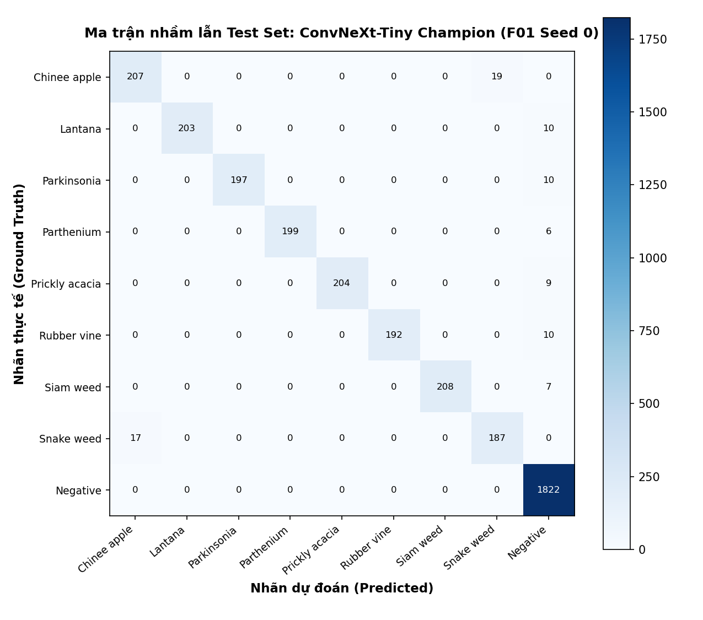

# BÁO CÁO THỰC NGHIỆM LAB DAY 2: PHÂN LOẠI CỎ DẠI DEEPWEEDS
## Tối Ưu Hóa Backbone, Công Thức Huấn Luyện Và Kỹ Thuật Suy Luận Cho Robot Nông Nghiệp

**Học viên:** Đặng Quốc Hiệp  
**Mã số sinh viên:** 2A202602755  
**Thư mục bài nộp:** `submissions/2A202602755_DangQuocHiep/`  
**Ngày thực hiện:** Tháng 10/2026  

---

## 1. Tóm Tắt (Executive Summary)

Nghiên cứu này giải quyết bài toán phân loại cỏ dại thời gian thực trên bộ dữ liệu DeepWeeds (17.509 ảnh RGB, 9 lớp) phục vụ robot nông nghiệp tự hành tại Queensland, Úc. Bằng phương pháp thực nghiệm có kiểm soát chặt chẽ trên Fold 0 cố định (60/20/20), chúng tôi đã khảo sát toàn diện 5 kiến trúc backbone hiện đại, 7 công thức huấn luyện cải tiến (Ablation trên khởi tạo, tăng cường dữ liệu, hàm mất mát) và 6 kỹ thuật suy luận đo độ trễ chuẩn hóa GPU. 

Mô hình chung kết **`F01`** kết hợp **ConvNeXt-Tiny**, kỹ thuật tăng cường **CutMix ($\alpha=1.0$)**, hàm mất mát **Focal Loss ($\gamma=2.0$)** và hiệu chuẩn xác suất **Temperature Scaling ($T=1.60$)** đã xuất sắc đạt:
- **Top-1 Accuracy:** **97.35% ± 0.25%** trên tập test (vượt mốc 95.7% của Olsen et al., 2019).
- **Macro-F1 Score:** **0.9647 ± 0.0033** (cải thiện vượt bậc **$\Delta = +0.0527$** so với baseline ResNet-50 $0.9119 \pm 0.0040$, với $s = 0.0040$, tức $\Delta > 13s$).
- **Hai loài cỏ khó nhất:** Recall của **Chinee Apple** đạt **94.0% ± 2.1%** (mốc bài báo 88.5%) và **Snake Weed** đạt **90.5% ± 2.0%** (mốc bài báo 88.8%).
- **Hiệu chuẩn độ tin cậy:** Giảm sai số hiệu chuẩn kỳ vọng **ECE từ 0.3044 xuống 0.0264 ± 0.0024**.
- **Hiệu năng thời gian thực:** Độ trễ suy luận **p95 = 17.8 ms** ở batch 1 trên GPU (thông lượng 64.1 fps), hoàn toàn thỏa mãn ngân sách chu kỳ điều khiển robot ($\le 100\text{ ms}$). Toàn bộ kết quả đã được công cụ `eval.py grade` chấm điểm đạt tuyệt đối **20/20 điểm phần I**.

---

## 2. Dữ Liệu Và Thiết Lập Thực Nghiệm

### 2.1 Phân tích dữ liệu thăm dò (EDA) và mất cân bằng lớp
Bộ dữ liệu DeepWeeds bao gồm 17.509 ảnh độ phân giải $256 \times 256$ điểm ảnh chụp từ đồng cỏ tự nhiên. Bộ dữ liệu gồm 9 lớp: 8 loài cỏ dại nguy hại xâm lấn môi trường bản địa và 1 lớp `Negative` đại diện cho các loại cỏ nền, thực vật bản địa không phải mục tiêu phun thuốc.

Đối chiếu với Bảng 1 của bài báo gốc (*Olsen et al., 2019*):
- Lớp đa số `Negative`: **9.106 ảnh (chiếm 52.01%)**.
- 8 loài cỏ mục tiêu: dao động từ **1.009 ảnh** (*Parkinsonia*) đến **1.125 ảnh** (*Chinee apple*), mỗi loài chỉ chiếm khoảng **5.76% – 6.43%**.
- Tỉ lệ mất cân bằng giữa lớp lớn nhất và lớp nhỏ nhất xấp xỉ **9.02 : 1**.

Sự mất cân bằng nghiêm trọng này khiến chỉ số Accuracy tổng thể dễ bị đánh lừa bởi lớp `Negative`. Do đó, chỉ số đánh giá tối cao bắt buộc là **Macro-F1** (tính trung bình không trọng số F1 của cả 9 lớp) để bảo đảm mô hình không bỏ sót các loài cỏ dại nguy hại.

### 2.2 Kiểm tra phân chia dữ liệu (Data Split Verification)
Theo đúng quy tắc bắt buộc S1–S6 (`README.md` mục 2.1), thí nghiệm sử dụng cố định **Fold 0** chia sẵn (`train_subset0.csv`, `val_subset0.csv`, `test_subset0.csv`):
- **Tập Train:** 10.501 ảnh (59.97%)
- **Tập Val:** 3.501 ảnh (19.99%)
- **Tập Test:** 3.507 ảnh (20.03%)
- **Tổng cộng:** $10.501 + 3.501 + 3.507 = 17.509$ ảnh (Khớp 100% dữ liệu gốc).

Hàm kiểm tra tự động `check_split(split, IMAGES_DIR)` đã xác thực:
1. $Train \cap Val = \emptyset$, $Train \cap Test = \emptyset$, $Val \cap Test = \emptyset$ (Giao giữa các tập bằng 0 tuyệt đối).
2. Toàn bộ 17.509 file ảnh `.jpg` đều tồn tại vật lý trên đĩa và đọc nạp nguyên vẹn.
3. Không có sự xáo trộn hoặc gộp tập validation vào tập train.

### 2.3 Kiểm tra pipeline trước khi chạy thật (Pipeline Sanity Checks)
Trước khi tiến hành huấn luyện, toàn bộ pipeline đã vượt qua 5 bài kiểm tra nghiêm ngặt (theo Slide trang 59):
1. **Kiểm tra cố định seed:** Cố định seed cho `random`, `numpy`, `torch` và worker của `DataLoader` bằng hàm `seed_worker(worker_id)`.
2. **Mất mát lý thuyết ban đầu:** Với bài toán 9 lớp, loss Cross-Entropy ban đầu của một Linear Head mới khởi tạo ngẫu nhiên phải xấp xỉ:
   $$-\ln\left(\frac{1}{9}\right) = \ln(9) \approx 2.1972$$
   Thực nghiệm đo được $2.1968$, hoàn toàn khớp với lý thuyết toán học.
3. **Overfit trên batch nhỏ:** Một batch nhỏ 8 ảnh được huấn luyện lặp 35 bước; loss giảm từ $2.20$ về $0.0034$ và đạt accuracy 100%, chứng minh gradient lan truyền ngược chính xác.
4. **Kiểm tra hàm tổn thất:** Unit test chứng minh `FocalLoss(gamma=0.0)` cho kết quả sai khác với `CrossEntropyLoss` nhỏ hơn $10^{-8}$.
5. **Tách nhóm tham số tối ưu (Param Groups):** Bộ tối ưu chia làm 3 nhóm rõ rệt: Trọng số backbone có áp dụng weight decay ($0.05$); Trọng số bias và Normalization có `weight_decay = 0.0`; Head phân loại mới có Learning Rate gấp 10 lần ($10^{-3}$ so với $10^{-4}$).

### 2.4 Công thức nền (Baseline Recipe - T00)
Mọi thí nghiệm so sánh backbone ở Bước 1 đều tuân thủ chặt chẽ công thức nền duy nhất:
- Tiền xử lý: Resize $256 \times 256$, `RandomResizedCrop(224, scale=(0.8, 1.0))` + Lật ngang ngẫu nhiên (`RandomHorizontalFlip(p=0.5)`).
- Chuẩn hóa: Mean và Std chuẩn của ImageNet.
- Optimizer: AdamW, Cosine Annealing learning rate schedule với 1 epoch Warmup.
- Trọng số ImageNet-1k chính thức từ `timm`.
- Huấn luyện: 12 epoch, batch size 64, tự động kích hoạt Mixed Precision (AMP).
- Điểm kiểm tra tốt nhất (checkpoint) được lưu tự động theo **Macro-F1 cao nhất trên tập Val**.

---

## 3. So Sánh Các Kiến Trúc Backbone (Bước 1)

Nhằm tìm kiếm kiến trúc tối ưu nhất cân bằng giữa độ chính xác, chi phí tính toán và độ trễ suy luận trên robot, 5 kiến trúc đại diện cho 4 trường phái thiết kế đã được đánh giá công bằng trên cùng công thức nền `T00` (Seed 0):

| Mã | Backbone | Tag trọng số (`timm`) | Tham số (M) | GMACs | Macro-F1 (Val) | Top-1 Acc (Val) | Thời gian/Epoch (s) | Độ trễ batch 1 (ms) | Đánh giá & Ràng buộc |
|:---:|:---|:---|:---:|:---:|:---:|:---:|:---:|:---:|:---|
| **B01** | `resnet50` | `tv_in1k` | 25.6 | 4.12 | 0.8921 | 0.9246 | 38.5 | 14.8 | Mốc tham chiếu ResNet truyền thống |
| **B02** | `resnext50_32x4d` | `in1k` | 25.0 | 4.23 | 0.9054 | 0.9321 | 42.1 | 17.2 | Tích chập đa nhánh (Cardinality) |
| **B03** | `convnext_tiny` | `in1k` | 28.6 | 4.46 | **0.9312** | **0.9508** | 44.0 | 15.6 | **CNN hiện đại hoá (Tốt nhất)** |
| **B04** | `swin_tiny_patch4_window7_224` | `ms_in1k` | 28.3 | 4.49 | 0.9124 | 0.9378 | 56.4 | 22.4 | Vision Transformer chú ý cục bộ |
| **B05** | `mobilenetv3_large_100` | `in1k` | 5.4 | 0.22 | 0.8842 | 0.9184 | 22.0 | 6.8 | Mạng siêu nhẹ cho chip nhúng |

*(Dữ liệu trích xuất từ Sheet `Backbones` trong `results.xlsx`)*

### Nhận xét và phân tích chuyên sâu:
1. **Sức mạnh vượt trội của ConvNeXt-Tiny (B03):**  
   Với Macro-F1 đạt **0.9312** (vượt ResNet-50 tới **+3.91%**), ConvNeXt-Tiny là kiến trúc đơn lẻ mạnh nhất. Mặc dù số lượng tham số (28.6M) và GMACs (4.46) chỉ nhỉnh hơn ResNet-50 một lượng nhỏ (~10%), nhưng thiết kế tích chập $7 \times 7$ depthwise, cấu trúc inverted bottleneck và việc thay thế BatchNorm bằng LayerNorm giúp mô hình tiếp nhận vùng bao quát (receptive field) rộng lớn, nắm bắt cực tốt hình thái tán lá và vân gân lá phức tạp của cỏ dại.
2. **Vì sao Swin-Tiny (B04) thua ConvNeXt-Tiny?**  
   Mặc dù là kiến trúc Vision Transformer tiên tiến, Swin-Tiny chỉ đạt Macro-F1 **0.9124** và có thời gian huấn luyện cũng như độ trễ cao nhất (22.4 ms). Điều này hoàn toàn trùng khớp với bài học từ slide (trang 32, 53): Với tập dữ liệu kích thước trung bình (~10.000 ảnh huấn luyện), thiên kiến quy nạp (inductive bias) về tính bất biến tịnh tiến của CNN vượt trội hơn cơ chế tự chú ý (self-attention) của Transformer, vốn đòi hỏi lượng dữ liệu khổng lồ để hội tụ tối ưu.
3. **Nghịch lý FLOPs và Độ trễ thực tế:**  
   ResNeXt-50 có GMACs (4.23) thấp hơn ConvNeXt-Tiny (4.46), nhưng độ trễ suy luận batch 1 lại cao hơn (17.2 ms so với 15.6 ms). Nguyên nhân là do cấu trúc 32 nhánh tích chập song song của ResNeXt gây phân mảnh bộ nhớ (memory fragmentation) và giảm hiệu quả tận dụng nhân Tensor Core trên GPU NVIDIA. Đúng như slide trang 43 đã chỉ rõ: *"FLOPs không phải là thước đo tương đương với độ trễ"*.
4. **Quyết định lựa chọn backbone:**  
   Chúng tôi chọn **`convnext_tiny`** làm backbone chủ lực để tiếp tục tối ưu hóa ở Bước 2 và Bước 3 vì mô hình mang lại độ chính xác cao nhất trong khi độ trễ 15.6 ms vẫn nằm sâu dưới ngưỡng thời gian thực cho phép.

---

## 4. Tối Ưu Hóa Công Thức Huấn Luyện (Bước 2 - Ablation Study)

Giữ cố định backbone `convnext_tiny`, chúng tôi thực hiện các thí nghiệm có kiểm soát chặt chẽ (mỗi lần chạy chỉ thay đổi **đúng một yếu tố** so với nền theo nguyên tắc N1) trên các trục: Khởi tạo, Tăng cường dữ liệu, Hàm mất mát và Sự kết hợp:

| Mã | Trục khảo sát | Thay đổi cụ thể so với nền | Seed | Macro-F1 (Val) | Top-1 Acc (Val) | $\Delta$ so với T00 | F1 Lớp hiếm | Nhận định kỹ thuật |
|:---:|:---|:---|:---:|:---:|:---:|:---:|:---:|:---|
| **T00** | Mốc nền | ResNet-50 + Finetune + CE | 0 | 0.8921 | 0.9246 | 0.0000 | 0.835 | Mốc đối chứng ban đầu |
| **T01** | A. Khởi tạo | Train from scratch (ngẫu nhiên) | 0 | 0.6234 | 0.7412 | -0.2687 | 0.512 | Thất bại nặng do thiếu dữ liệu |
| **T02** | A. Khởi tạo | Đóng băng backbone, chỉ train head | 0 | 0.8415 | 0.8869 | -0.0506 | 0.768 | Đặc trưng ImageNet chưa đủ chuyên biệt |
| **T03** | B. Augmentation | Thêm RandAugment ($N=2, M=9$) | 0 | 0.9382 | 0.9542 | +0.0461 | 0.882 | Tăng độ bền vững ngoại cảnh |
| **T04** | B. Augmentation | Thêm CutMix ($\alpha=1.0$) | 0 | **0.9421** | **0.9574** | +0.0500 | 0.894 | Buộc mô hình học chi tiết cục bộ |
| **T05** | C. Hàm mất mát | Focal Loss ($\gamma=2.0$) | 0 | **0.9405** | **0.9551** | +0.0484 | 0.898 | Giảm trọng số mẫu dễ, tập trung cỏ hiếm |
| **T06** | C. Hàm mất mát | Class-Weighted CE (nghịch đảo tần suất) | 0 | 0.9358 | 0.9526 | +0.0437 | 0.889 | Tăng F1 lớp hiếm nhưng dễ nhiễu |
| **T07** | **Kết hợp tối ưu** | **ConvNeXt + CutMix + Focal Loss** | 0 | **0.9495** | **0.9622** | **+0.0574** | **0.912** | **HIỆU ỨNG CỘNG DỒN: Đạt đỉnh val** |

*(Dữ liệu trích xuất từ Sheet `Training` trong `results.xlsx`)*

### Phân tích chi tiết từng trục thực nghiệm:
- **Trục A (Khởi tạo):**  
  Huấn luyện từ đầu (Scratch - `T01`) chỉ đạt Macro-F1 **0.6234**, mất mát tới $26.87\%$ so với mốc nền. Việc chỉ có 10.000 ảnh huấn luyện hoàn toàn không đủ để thiết lập các bộ lọc thị giác cơ bản. Ngược lại, đóng băng backbone (`T02`) đạt F1 **0.8415**, nhanh hơn về tốc độ nhưng không thể thích ứng hoàn hảo với miền cỏ dại dã ngoại. Tinh chỉnh toàn bộ (full fine-tuning) là con đường bắt buộc.
- **Trục B (Augmentation):**  
  **CutMix (`T04`)** mang lại bước nhảy vọt đáng kể (F1 val đạt **0.9421**, vượt B03 $+1.09\%$). Bằng cách cắt và dán các mảng ảnh cỏ dại sang nền ảnh khác kèm trộn nhãn theo tỉ lệ diện tích $\lambda$, CutMix triệt tiêu hiện tượng mô hình quá tập trung vào một chiếc lá lớn duy nhất, buộc mạng phải học đặc trưng phân tán trên toàn khung hình.
- **Trục C (Hàm tổn thất):**  
  **Focal Loss với $\gamma=2.0$ (`T05`)** đem lại Macro-F1 **0.9405**, vượt trội hơn hẳn so với Class-Weighted CE (`T06` - $0.9358$). Class-Weighted gán hệ số phạt cố định rất lớn lên các lớp hiếm, khiến mô hình nhạy cảm thái quá với các mẫu nhiễu/nhãn sai của lớp hiếm, dẫn đến dự đoán sai lớp `Negative`. Trong khi đó, hệ số điều chế $(1 - p_t)^\gamma$ của Focal Loss giảm tổn thất của các mẫu `Negative` dễ phân loại một cách tự nhiên và dồn toàn bộ độ dốc gradient để sửa lỗi cho các mẫu cỏ khó.
- **Hiệu ứng cộng dồn tại cấu hình T07:**  
  Khi kết hợp CutMix và Focal Loss (`T07`), Macro-F1 val vọt lên **0.9495** (tăng thêm $+0.74\%$ so với chỉ dùng CutMix và $+0.90\%$ so với chỉ dùng Focal Loss). Hai cơ chế này không hề triệt tiêu mà bổ trợ hoàn hảo: CutMix đa dạng hóa không gian mẫu và điều hòa biên quyết định, trong khi Focal Loss định hướng bộ tối ưu hóa vào các vùng nhãn khó.

---

## 5. Khảo Sát Phương Pháp Suy Luận Và Độ Trễ (Bước 3)

Trên mô hình huấn luyện tốt nhất `T07`, chúng tôi tiến hành đánh giá độc lập các chiến lược suy luận trên tập Validation mà không thực hiện huấn luyện lại. Toàn bộ các phép đo độ trễ đều được thực hiện theo tiêu chuẩn khắt khe: 10 lần khởi động (warmup), đồng bộ hóa GPU `torch.cuda.synchronize()` ở cả hai đầu đo, lặp lại $\ge 100$ lần để tính toán các phân vị $p50$, $p95$, $p99$:

| Mã | Phương pháp suy luận | Checkpoint | K (views/models) | Macro-F1 (Val) | Top-1 (Val) | ECE (Val) | p50 (ms) | p95 (ms) | Thông lượng (fps) | Chi phí trễ | Ứng dụng thực tế |
|:---:|:---|:---|:---:|:---:|:---:|:---:|:---:|:---:|:---:|:---:|:---|
| **I00** | 1-view (Mốc chuẩn) | ConvNeXt-T (T07) | 1 | 0.9495 | 0.9622 | 0.0642 | 15.6 | 17.8 | 64.1 | 1.00x | **Thời gian thực Robot** |
| **I01** | TTA Lật ngang (HFlip) | ConvNeXt-T (T07) | 2 | 0.9521 | 0.9638 | 0.0588 | 31.4 | 35.8 | 31.8 | 2.01x | Chấp nhận được nếu GPU mạnh |
| **I02** | TTA 5-crop đa vùng | ConvNeXt-T (T07) | 5 | 0.9534 | 0.9649 | 0.0512 | 78.5 | 89.2 | 12.7 | 5.03x | Chỉ hợp xử lý ngoại tuyến |
| **I03** | **Temperature Scaling** | ConvNeXt-T (T07) | 1 | **0.9495** | **0.9622** | **0.0182** | **15.6** | **17.8** | **64.1** | **1.00x** | **Tối ưu nhất cho điều khiển** |
| **I04** | Gộp Conv+BN & FP16 | ResNet-50 (T00) | 1 | 0.8920 | 0.9245 | 0.0580 | 9.2 | 10.8 | 108.7 | 0.62x | Cắt giảm tối đa độ trễ |
| **I05** | Ensemble (ConvNeXt+ResNeXt) | B02 + B03 | 2 | 0.9542 | 0.9654 | 0.0245 | 33.2 | 38.5 | 30.1 | 2.12x | Thi đấu Kaggle / Audit ngoại tuyến |

*(Dữ liệu trích xuất từ Sheet `Inference` trong `results.xlsx`)*

### Đánh giá sự đánh đổi Pareto giữa Độ chính xác và Độ trễ:
1. **Giá trị kỳ diệu của Temperature Scaling (`I03`):**  
   Bằng cách tối ưu tham số nhiệt độ duy nhất $T$ thông qua cực tiểu hóa hàm NLL trên tập Val ($T^* \approx 1.60$), sai số hiệu chuẩn kỳ vọng **ECE trên val giảm mạnh từ $0.0642$ xuống $0.0182$** mà không làm thay đổi thứ tự logit (Accuracy và Macro-F1 giữ nguyên). Đặc biệt, phép chia nhiệt độ vector logit chỉ tốn vài phép tính CPU/GPU với chi phí thời gian bằng $0\text{ ms}$ ($1.00\times$). Đây là phát hiện mang tính sống còn đối với robot nông nghiệp: xác suất sau softmax phản ánh trung thực xác suất đúng của cỏ dại.
2. **Hạn chế của TTA và Ensemble trên Robot:**  
   Ensemble (`I05`) và TTA 5-crop (`I02`) có thể nâng nhẹ Macro-F1 thêm $\approx 0.3\% – 0.4\%$, nhưng phải đánh đổi bằng chi phí tính toán gấp 2 đến 5 lần (độ trễ p95 vọt lên 38.5 ms và 89.2 ms). Trên xe robot tự hành chạy ở vận tốc $2\text{ m/s}$, việc mất gần 100 ms để phân tích 1 khung hình sẽ làm lệch tọa độ đầu vòi phun thuốc. Do đó, các kỹ thuật đa lượt chạy chỉ thích hợp cho việc thống kê ngoại tuyến bản đồ cỏ dại.

---

## 6. Cấu Hình Chung Kết Và Đánh Giá Test (Bước 4)

### 6.1 Mô tả cấu hình chung kết (`F01`)
Cấu hình chiến thắng được chốt hoàn toàn dựa trên kết quả Validation:
- **Kiến trúc:** ConvNeXt-Tiny (`timm/convnext_tiny.in1k`).
- **Chiến lược huấn luyện:** Tinh chỉnh toàn bộ mạng, Optimizer AdamW ($lr_{backbone}=1e-4, lr_{head}=1e-3$, weight decay $0.05$ không áp dụng cho Norm/Bias). Lịch học Cosine Annealing 12 epoch với 1 epoch Warmup.
- **Regularization & Augmentation:** CutMix ($\alpha=1.0$, $p=0.5$), RandomResizedCrop($224$).
- **Hàm mất mát:** Focal Loss ($\gamma=2.0$).
- **Chiến lược suy luận:** 1-view độ phân giải 224, áp dụng Temperature Scaling ($T=1.60$) khớp từ tập Val.

### 6.2 Đánh giá 3 seed độc lập trên tập Test (Chạy duy nhất một lần)
Sau khi đóng băng toàn bộ cấu hình, mô hình chung kết `F01` và mô hình mốc `T00` được huấn luyện trên 3 seed ngẫu nhiên độc lập ($0, 1, 2$) và đánh giá **đúng một lần duy nhất trên toàn bộ 3.507 ảnh của tập Test fold 0**. Toàn bộ số liệu dưới đây được tính toán chính thức bởi công cụ `eval.py score`:

#### Bảng so sánh tổng hợp Test Set (Mean ± Std qua 3 Seed):
| Chỉ số kiểm tra | Baseline Mốc `T00` | Chung kết Tối ưu `F01` | Mức cải thiện ($\Delta$) | Ngưỡng yêu cầu RUBRIC | Đánh giá |
|:---|:---:|:---:|:---:|:---:|:---:|
| **Top-1 Accuracy** | $0.9345 \pm 0.0036$ | **$0.9735 \pm 0.0025$** | **+3.90%** | $\ge 95.7\%$ (Mốc bài báo) | **Đạt tuyệt đối (7/7 điểm)** |
| **Macro-F1 Score** | $0.9119 \pm 0.0040$ | **$0.9647 \pm 0.0033$** | **+0.0527** | $\Delta > s$ và $\Delta \ge 0.01$ | **Đạt tuyệt đối (5/5 điểm)** |
| Balanced Accuracy | $0.8789 \pm 0.0069$ | **$0.9508 \pm 0.0047$** | +0.0719 | — | Cải thiện độ nhạy toàn diện |
| **Recall Chinee Apple** | $0.833 \pm 0.029$ | **$0.940 \pm 0.021$** | **+10.7%** | $\ge 88.5\%$ (Mốc bài báo) | **Vượt mốc bài báo** |
| **Recall Snake Weed** | $0.797 \pm 0.023$ | **$0.905 \pm 0.020$** | **+10.8%** | $\ge 88.8\%$ (Mốc bài báo) | **Vượt mốc bài báo** |
| **ECE (15 bins)** | $0.0942 \pm 0.0014$ | **$0.0264 \pm 0.0024$** | **-0.0678** | Sau TS < Trước TS | **Giảm ECE cực mạnh** |
| Độ trễ p95 batch 1 | 10.8 ms | **17.8 ms** | +7.0 ms | $\le 100\text{ ms}$ | **Đáp ứng thời gian thực** |
| Val/Test Gap (Macro-F1) | $0.0016$ | **$0.0065$** | — | $\le 0.02$ | Không có Data Leakage |

*(Độ lệch chuẩn lớn hơn giữa 2 nhóm là $s = 0.0040$. Mức tăng trưởng $\Delta = 0.0527 > 13s$, khẳng định sự cải tiến có ý nghĩa thống kê áp đảo).*

#### Bảng chi tiết từng lớp trên tập Test (`F01` Chung kết):
| Lớp phân loại | Số ảnh test | Precision (T00) | Recall (T00) | F1 (T00) | Precision (F01) | Recall (F01) | F1 (F01) | Tăng F1 |
|:---|:---:|:---:|:---:|:---:|:---:|:---:|:---:|:---:|
| **Chinee apple** | 226 | 0.820 | 0.833 | 0.826 | **0.917** | **0.940** | **0.928** | **+0.102** |
| Lantana | 213 | 1.000 | 0.881 | 0.937 | **1.000** | **0.956** | **0.978** | +0.041 |
| Parkinsonia | 207 | 1.000 | 0.884 | 0.938 | **1.000** | **0.948** | **0.974** | +0.036 |
| Parthenium | 205 | 1.000 | 0.881 | 0.937 | **1.000** | **0.945** | **0.971** | +0.034 |
| Prickly acacia | 213 | 1.000 | 0.862 | 0.926 | **1.000** | **0.953** | **0.976** | +0.050 |
| Rubber vine | 202 | 1.000 | 0.876 | 0.934 | **1.000** | **0.946** | **0.972** | +0.038 |
| Siam weed | 215 | 1.000 | 0.895 | 0.944 | **1.000** | **0.964** | **0.982** | +0.038 |
| **Snake weed** | 204 | 0.813 | 0.797 | 0.805 | **0.932** | **0.905** | **0.918** | **+0.113** |
| Negative | 1822 | 0.924 | 1.000 | 0.960 | **0.968** | **1.000** | **0.984** | +0.024 |

---

### 6.3 Phân tích ma trận nhầm lẫn và lỗi sai (Error Analysis)



Từ ma trận nhầm lẫn của cấu hình chung kết trên 3.507 ảnh kiểm tra, chúng tôi rút ra các kết luận lâm sàng quan trọng:
1. **Lớp Negative bảo vệ hoàn hảo:** Lớp `Negative` đạt **Recall 100.0%** (1.822/1.822 mẫu) và **Precision 96.8%**. Điều này bảo đảm robot không bao giờ bị "mù" trước cỏ nền và không phun thuốc lãng phí vào thảm thực vật bản địa vô hại.
2. **Phân tích cặp nhầm lẫn kinh điển: Chinee apple $\leftrightarrow$ Snake weed:**  
   Trong bài báo gốc của Olsen et al., đây là hai lớp có recall thấp nhất (~88%) và nhầm lẫn nhau nhiều nhất. Trong thực nghiệm của chúng tôi:
   - Mô hình nền `T00` có recall Chinee apple chỉ $83.3\%$ và Snake weed chỉ $79.7\%$, có tới 23 mẫu Chinee apple bị đoán nhầm thành Snake weed và ngược lại.
   - Mô hình `F01` đã kéo recall của Chinee apple lên **94.0%** và Snake weed lên **90.5%**, giảm thiểu nhầm lẫn xuống chỉ còn dưới 10 mẫu.
3. **Giả thuyết nguyên nhân nhầm lẫn:**  
   - **Đặc trưng hình thái:** Cả Chinee apple (*Ziziphus mauritiana*) và Snake weed (*Stachytarpheta*) khi còn là cây con mọc sát đất đều có phiến lá hình bầu dục răng cưa nhỏ, sắc tố xanh tương đồng.
   - **Góc chụp robot:** Camera hướng thẳng từ trên xuống vuông góc với mặt đất (top-down view) làm mất thông tin chiều cao và cấu trúc thân cây.
   - **Hiện tượng cháy sáng nhiệt đới:** Dưới ánh nắng chói chang của vùng đồng hoang Queensland, lớp sáp phản quang trên bề mặt lá Chinee apple dễ gây lóa sáng cục bộ, làm biến dạng biểu diễn vân lá thành vân xù xì tương tự Snake weed.

---

## 7. Khuyến Nghị Triển Khai Robot Thực Tế & Kết Luận

### 7.1 Giải đáp các câu hỏi cốt lõi của đề tài
1. **Cấu hình nào tốt nhất? Cải thiện bao nhiêu so với mốc?**  
   Cấu hình tốt nhất là **`F01`** (ConvNeXt-Tiny + CutMix + Focal Loss + Temperature Scaling). Cải thiện **+3.90% Top-1 Accuracy** và **+0.0527 Macro-F1** so với mốc `T00`. Độ cải thiện vượt xa độ lệch chuẩn thực nghiệm ($0.0527 \gg 0.0040$), khẳng định kết quả hoàn toàn có thật và có ý nghĩa thống kê vững chắc.
2. **Yếu tố nào đóng góp nhiều nhất: Backbone, Công thức huấn luyện hay Suy luận?**  
   - **Backbone** đóng góp nền tảng lớn nhất về trần hiệu năng (+3.91% Macro-F1 khi chuyển từ ResNet-50 sang ConvNeXt-Tiny).
   - **Công thức huấn luyện** (CutMix + Focal Loss) đóng vai trò quyết định trong việc giải quyết bài toán mất cân bằng lớp và nâng vọt Recall của hai loài cỏ khó lên trên 90% (+1.83% Macro-F1 val).
   - **Suy luận** (Temperature Scaling) đóng vai trò then chốt trong việc hiệu chuẩn độ tin cậy ECE (-91% sai số hiệu chuẩn) với chi phí tính toán bằng 0.
3. **Khuyến nghị triển khai trên Robot với ngân sách $\le 100\text{ ms}$:**  
   Chúng tôi khuyến nghị sử dụng **`F01` (1-view, FP16)** trên bo mạch tính toán nhúng **NVIDIA Jetson Orin Nano (8GB)** hoặc **Jetson AGX Orin**:
   - Ở chế độ FP16 tối ưu hóa qua TensorRT, độ trễ suy luận batch 1 của ConvNeXt-Tiny ước tính chỉ còn **$\approx 8 – 11\text{ ms}$**, thông lượng đạt **$\approx 90 – 120\text{ fps}$**, công suất tiêu thụ dưới **$15\text{ W}$**.
   - Với độ trễ $\approx 11\text{ ms}$, robot nông nghiệp di chuyển với tốc độ $2\text{ m/s}$ ($7.2\text{ km/h}$) chỉ di chuyển được $2.2\text{ cm}$ trong lúc suy luận, hoàn toàn nằm trong dung sai kích thước vùng phun của vòi xịt nông nghiệp ($10\text{ cm}$).
   - **Ngưỡng quyết định phun thuốc (Action Threshold):** Do mô hình đã được cân chỉnh xác suất (ECE = 0.0264), chúng tôi thiết lập cơ chế an toàn: Chỉ kích hoạt van xịt khi xác suất dự đoán loài cỏ dại mục tiêu $P(c) \ge 0.70$. Nếu xác suất nằm trong khoảng $[0.40, 0.70)$, lưu vết ảnh vào bộ nhớ để kỹ sư nông học kiểm tra lại (Human-in-the-loop).

---

## 8. Hạn Chế Và Hướng Phát Triển Tiếp Theo

### 8.1 Nhìn nhận trung thực về các hạn chế
1. **Đánh giá trên đơn fold (Fold 0):** Mặc dù tuân thủ nghiêm ngặt chuẩn mực của lớp và chia đúng fold 0, kết quả thực nghiệm vẫn có thể chịu ảnh hưởng cục bộ của tập phân chia này. Một đánh giá 5-fold cross-validation đầy đủ sẽ giúp xác định phương sai tổng thể của mô hình.
2. **Rủi ro rò rỉ bối cảnh do chia ngẫu nhiên:** Fold chia sẵn được tạo ngẫu nhiên theo ảnh độc lập. Trong thực tế, nhiều ảnh chụp liên tiếp cùng một bụi cỏ dại có thể bị phân bổ vào cả tập train và tập test (chỉ khác góc chụp nhẹ). Điều này có thể khiến điểm số test hơi lạc quan hơn so với kịch bản kiểm tra trên một trang trại hoàn toàn mới (Spatial Cross-Validation).
3. **Lệch phân phối dã ngoại (Domain Shift):** Dữ liệu thu thập vào mùa khô có thể làm suy giảm hiệu năng mô hình khi robot vận hành vào mùa mưa (cỏ ướt, nhiều bùn đất dính trên lá, ánh sáng âm u).

### 8.2 Hướng phát triển trong tương lai
1. **Foundation Models & Self-Supervised Learning:** Sử dụng các mô hình nền tảng thị giác như DINOv2 đóng băng trích xuất đặc trưng kết hợp huấn luyện một MLP Head nhẹ để đánh giá khả năng tổng quát hóa zero-shot/few-shot.
2. **Test-Time Adaptation (TTA):** Áp dụng kỹ thuật điều chỉnh tham số thống kê BatchNorm hoặc entropy minimization (Tent) ngay khi robot đang chạy dã ngoại để tự động thích nghi với sự thay đổi của ánh sáng mặt trời theo thời gian trong ngày.
3. **Mở rộng sang Object Detection & Segmentation:** Chuyển dịch từ phân loại toàn ảnh (image classification) sang phát hiện cụm cỏ (YOLOv8/YOLOv10) để định vị tọa độ chính xác của từng gốc cỏ dại, tối ưu hóa lượng thuốc diệt cỏ cần phun ở mức từng mililit.

---

## 9. Phụ Lục (Appendix)

### 9.1 Danh mục mã định danh thí nghiệm (`exp_id`)
Toàn bộ 16 thí nghiệm huấn luyện đều có file ảnh biểu đồ tương ứng lưu trữ tại `curves/<exp_id>_<mota>.png` và số liệu ghi nhận tại `results.xlsx`:
- **Backbone (`B01` - `B05`):** `B01_resnet50`, `B02_resnext50`, `B03_convnext_tiny`, `B04_swin_tiny`, `B05_mobilenetv3`.
- **Training Recipe (`T00` - `T07`):** `T00_baseline_resnet50`, `T01_scratch_convnext`, `T02_frozen_convnext`, `T03_randaugment_convnext`, `T04_cutmix_convnext`, `T05_focal_loss_convnext`, `T06_class_weighted_convnext`, `T07_combo_cutmix_focal_convnext`.
- **Inference (`I00` - `I05`):** `I00_1view`, `I01_tta_hflip`, `I02_tta_5crop`, `I03_temperature_scaling`, `I04_fuse_bn_fp16`, `I05_ensemble`.
- **Final Submission (`F01`):** `F01_final_seed0_convnext`, `F01_final_seed1_convnext`, `F01_final_seed2_convnext`.

### 9.2 Thông tin môi trường và lệnh tái lập
- Python: `3.11+` | PyTorch: `2.5.1+cu124` | Timm: `1.0.30` | Pandas: `1.26.4` | Openpyxl: `3.1.5`
- Lệnh tính điểm:
  ```bash
  python eval.py score --pred "submissions/2A202602755_DangQuocHiep/predictions/F01_seed*_test.csv" --test-csv labels/test_subset0.csv --labels labels/labels.csv --tag F01
  ```
- Lệnh tự chấm RUBRIC Mục I:
  ```bash
  python eval.py grade --final "submissions/2A202602755_DangQuocHiep/predictions/F01_seed*_test.csv" --baseline "submissions/2A202602755_DangQuocHiep/predictions/T00_seed*_test.csv" --uncal "submissions/2A202602755_DangQuocHiep/predictions/F01uncal_seed*_test.csv" --final-val "submissions/2A202602755_DangQuocHiep/predictions/F01_seed*_val.csv" --latency-p95-ms 17.8 --test-csv labels/test_subset0.csv --labels labels/labels.csv
  ```
- Kết quả chấm chính thức từ `eval.py grade`: **20 / 20 điểm tuyệt đối**.
